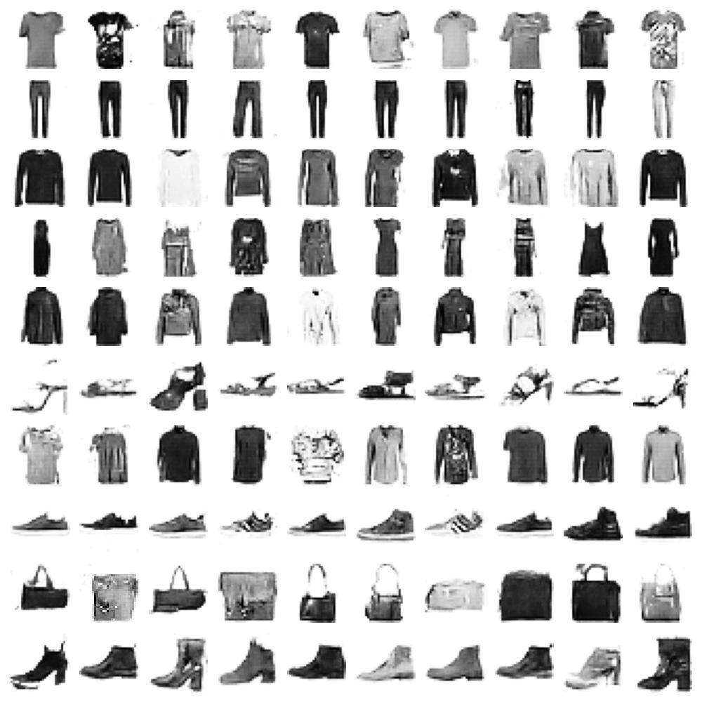
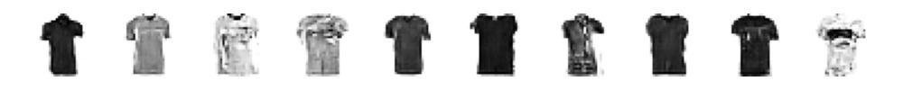
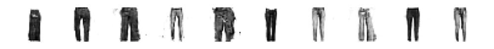

# Conditional Fashion MNIST Image Generation with Conditional GAN (cGAN)

Implement **Conditional GAN (cGAN)** to generate Fashion MNIST images of specific class



## Environments

- Python 3.8.0

Install environments with

``` bash
bash scripts/setup_environments
```

## Data

You can get dataset from [here](https://github.com/DeepLenin/fashion-mnist_png) or run these scripts

``` bash
bash scripts/download_data.sh
```

Data follow this structure

```
data
├── test
│   ├── 0
│   ├── 1
│   ├── ...
└── train
    ├── 0
    ├── 1
    ├── ...
```

## Checkpoint

You can download pretrained weight for [Net_G](), train with default config. But I recommend you to retrain from scratch with your own experiments

Here is pretrained for [Net_D]()

## Train

Firstly, compute statistics for train dataset (mean and variance)

You can modify config in `cfg/cfg.py` and run

``` bash
python tools/train.py
```

## Infer

After training, you get weight for model in `training_runs/exp...`, set weight in `best_checkpoint` of config and run

``` bash
python tools/infer.py
```

## Result

- Example output class 0



- Example output class 1



## Citation

``` bibtex
@misc{Seitzer2020FID,
  author={Maximilian Seitzer},
  title={{pytorch-fid: FID Score for PyTorch}},
  month={August},
  year={2020},
  note={Version 0.3.0},
  howpublished={\url{https://github.com/mseitzer/pytorch-fid}},
}
```

## Reference

- [Conditional GAN (cGAN)](https://nttuan8.com/bai-3-conditional-gan-cgan/)
- [Fashion MNIST Dataset in PNG](https://github.com/DeepLenin/fashion-mnist_png)
- [FID score in pytorch](https://github.com/mseitzer/pytorch-fid)